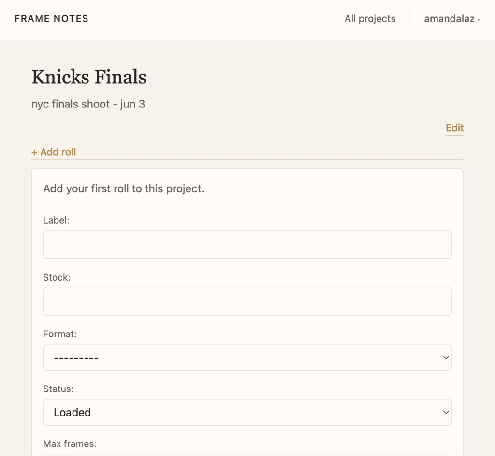

# Frame Notes

Frame Notes is a workflow tool for film photographers. It helps organize projects, track rolls, capture frame level notes, and review scans from contact sheet to final print.

**Status:** Active development. Core roll tracking, frame notes, scan import, contact sheet review, and user accounts are functional. Production deployment is not yet configured.




---

## Features

- **Accounts** — sign up, log in, and keep projects private to each user
- **Projects** — group rolls for a trip, theme, or body of work
- **Film rolls** — track stock, format, status, ISO, and roll metadata
- **Frame notes** — attach observations, exposure notes, and scan images to individual frames
- **Contact sheets** — browse scans in a filmstrip-style grid with frame numbers, favorites, and lightbox viewing
- **Lab import** — upload a folder of scans and map them to frames

---

## Current capabilities

- User sign-up, login, logout, and account deletion
- Per-user project lists (projects scoped to the signed-in owner)
- Projects, film rolls, and frame notes
- Lab scan import from roll page
- Contact sheet review with lightbox
- Favorites and in-lightbox note editing (AJAX)

---

## Data model

Django’s built-in **User** owns **Project** records. **FilmRoll** is the main physical-roll record and can belong to zero or more projects (many-to-many). Each roll has **FrameNote** rows for edge numbers, text notes, scan images, and favorites.


Deleting a user removes their projects (CASCADE). Rolls that were only linked via M2M may remain in the database until removed explicitly.

---

## Roadmap

- Require `Project.owner` (non-null) after data migration for legacy rows
- Rolls-first home / index view
- Filter projects and contact sheets by favorites
- Darkroom print tracking
- Advanced search and filtering
- Mobile-friendly workflow
- Production deployment

---

## Stack

- Python 3.12+
- Django 6
- SQLite (development)
- Pillow (image uploads)

---

## Local setup

```bash
git clone https://github.com/amandallaz/frame_notes.git
cd frame_notes
python3 -m venv venv
source venv/bin/activate
pip install -r requirements.txt
python manage.py migrate
python manage.py runserver
```

Open [http://127.0.0.1:8000/](http://127.0.0.1:8000/) — use **Sign up** or **Log in** to reach your projects.

Scans are stored in `media/` (gitignored). After cloning, create an account and add projects from the app, or assign `Project.owner` in the shell for any existing rows from before accounts were added.

Import images from the **Import folder** panel on any roll.
