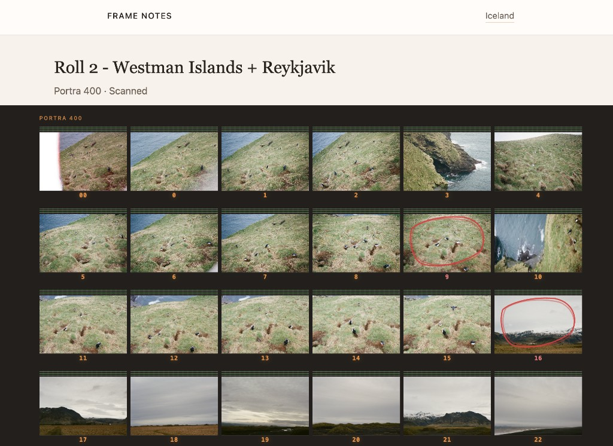

# Frame Notes

Frame Notes is a workflow tool for film photographers. It helps organize projects, track rolls, capture frame-level notes, and review scans from contact sheet to final print.

**Status:** Active development. Core roll tracking, frame notes, scan import, and contact sheet workflows are functional. Production deployment is not yet configured.



---

## Features

- **Film rolls** — track stock, format, status, ISO, and roll metadata
- **Frame notes** — attach observations, exposure notes, and scan images to individual frames
- **Contact sheets** — browse scans in a filmstrip-style grid with frame numbers, favorites, and lightbox viewing

---

## Current capabilities

- Projects
- Film rolls
- Frame notes
- Lab scan import
- Contact sheet review
- Favorites and selects

---

## Roadmap

- User accounts
- Darkroom print tracking
- Advanced search and filtering
- Mobile-friendly workflow
- Production deployment

---

## Stack

- Python 3.12+
- Django 6
- SQLite (development)
- Pillow (image uploads)

---

## Local setup

```bash
git clone https://github.com/amandallaz/frame_notes.git
cd frame_notes
python3 -m venv venv
source venv/bin/activate
pip install -r requirements.txt
python manage.py migrate
python manage.py runserver
```

Open [http://127.0.0.1:8000/](http://127.0.0.1:8000/)

Scans are stored in `media/` (gitignored). After cloning, import images from the **Import folder** panel on any roll.
