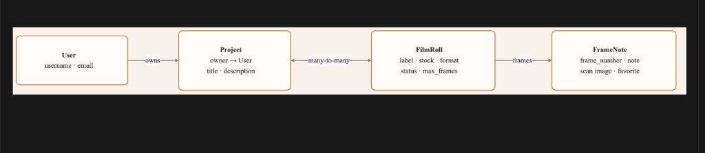

# Frame Notes

Frame Notes is a workflow tool for film photographers. It helps organize projects, track rolls, capture frame level notes, and review scans from contact sheet to final print.

**Status:** Active development. Core roll tracking, frame notes, scan import, contact sheet review, and user accounts are functional. 


---

## Features

- **Accounts** — sign up, log in, and keep projects private to each user
- **Projects** — group rolls for a trip, theme, or body of work
- **Film rolls** — track stock, format, status, ISO, and roll metadata
- **Frame notes** — attach observations, exposure notes, and scan images to individual frames
- **Contact sheets** — browse scans in a filmstrip-style grid with frame numbers, favorites, and lightbox viewing
- **Lab import** — upload a folder of scans and map them to frames

---

## Current capabilities

- User sign-up, login, logout, and account deletion
- Per-user project lists (projects scoped to the signed-in owner)
- Projects, film rolls, and frame notes
- Lab scan import from roll page
- Contact sheet review with lightbox
- Favorites and frame note editing from the lightbox view 

---

## Data model

Django’s built-in **User** owns **Project** records. **FilmRoll** represents a physical roll of film and may be associated with multiple projects. Each roll contains **FrameNote** records for edge numbers, notes, scan images, and favorites.



---

## Roadmap

See [ROADMAP.md](ROADMAP.md) for planned work (next up: external testing, production deploy).

---

## Stack

- Python 3.12+
- Django 6
- SQLite (development)
- Pillow (image uploads)

---

## Local setup

```bash
git clone https://github.com/amandallaz/frame_notes.git
cd frame_notes
python3 -m venv venv
source venv/bin/activate
pip install -r requirements.txt
python manage.py migrate
python manage.py runserver
```

Open [http://127.0.0.1:8000/](http://127.0.0.1:8000/) — use **Sign up** or **Log in** to reach your projects.

Copy `.env.example` to `.env` and add **Cloudinary** credentials for cloud scans; without them, files go to `media/` (gitignored).

After cloning, create an account and add projects from the app. Import images from the **Import folder** panel on any roll.

---

## Test on your phone (ngrok)

Expose your local `runserver` with a public HTTPS URL.

1. Install [ngrok](https://ngrok.com/download) and sign in (free account).
2. Terminal 1 — app:

   ```bash
   source venv/bin/activate
   python manage.py runserver
   ```

3. Terminal 2 — tunnel (port **8000**, not 80):

   ```bash
   ngrok http 8000
   ```

   If your ngrok account has a reserved dev domain (see [Domains](https://dashboard.ngrok.com/domains)):

   ```bash
   ngrok http --url=your-name.ngrok-free.dev 8000
   ```

4. Copy the **https** forwarding URL (e.g. `https://your-name.ngrok-free.dev`).
5. Add to `.env`:

   ```env
   NGROK_ORIGIN=https://your-name.ngrok-free.dev
   ```

6. Restart `runserver`, then open that URL on your phone or send it to a friend.

`ALLOWED_HOSTS` allows ngrok hostnames in debug mode. `NGROK_ORIGIN` is required so login and POST requests pass CSRF checks. The tunnel only works while your Mac is running both `runserver` and ngrok.

---

## License

This project is licensed under the MIT License. See the LICENSE file for details.
